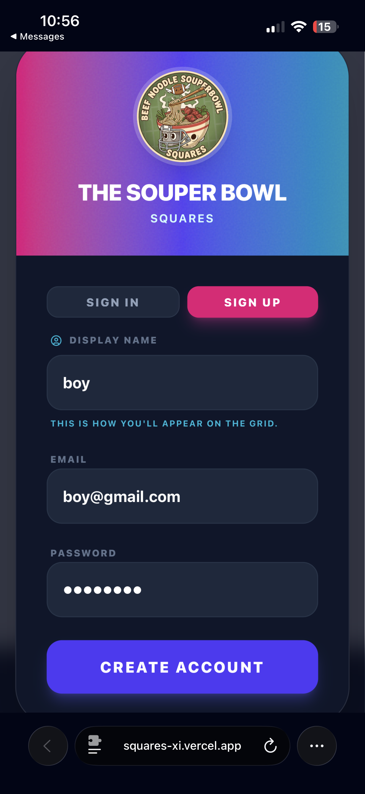
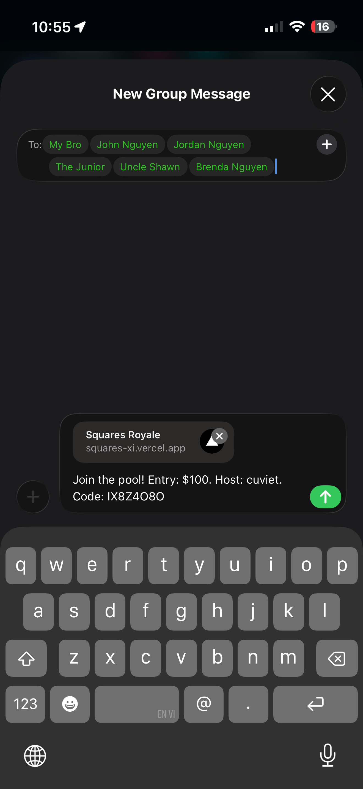

# 🏈 SmashedBox - Souper Bowl Squares

> **"Because with us, a Nguyen is always a Win"**


## 📖 Introduction

**SmashedBox** is a modern, real-time web application designed to take your Super Bowl Squares pool to the next level. Built with **Next.js 15**, **Firebase**, and **Tailwind CSS**, it offers a sleek, dark-themed interface for hosting and joining flexible sports betting games.

Say goodbye to paper grids and spreadsheets. SmashedBox handles the randomization, user management, and live scoring updates automatically.

## ✨ Key Features

*   **🏆 Dynamic Grids:** Automated, fair randomization of row/column numbers using the Fisher-Yates shuffle algorithm for every quarter (Q1, Q2, Q3, Final).
*   **🔐 Secure Authentication:** Robust email/password login and account management powered by Firebase Auth.
*   **⚡ Real-Time Updates:** Live integration with ESPN scores to track game progress and automatically determine winning squares.
*   **📱 Responsive UI:** Mobile-first design ensuring a great experience on any device, featuring smooth animations with **Framer Motion**.
*   **🎲 Prop Bets:** Create and manage side bets alongside the main grid.
*   **🤝 Easy Sharing:** Simple game codes allow friends to join your pool instantly.
*   **🎨 Personalized Profiles:** Track your game history and stats.

## 🚀 Technologies Used

*   **Framework:** [Next.js 15](https://nextjs.org/) (App Router)
*   **Language:** [TypeScript](https://www.typescriptlang.org/)
*   **Styling:** [Tailwind CSS](https://tailwindcss.com/) & [Tailwind Merge](https://github.com/dcastil/tailwind-merge)
*   **Icons:** [Lucide React](https://lucide.dev/)
*   **Backend / Auth:** [Firebase](https://firebase.google.com/)
*   **Animations:** [Framer Motion](https://www.framer.com/motion/)

## 📸 Screenshots

### 🏠 Join & Authentication
*Sleek landing page for logging in or joining a game via code.*  


### 📊 Interactive Grid View
*Navigate through different quarters and view the automated numbers.*  


### 👥 Secure Auth Flow
*User-friendly account creation and login process.*  


### 📲 Share & Preview
*Easily invite others to your game instance.*  


## 🛠️ Getting Started

Follow these steps to set up the project locally.

### Prerequisites

*   Node.js (v18+ recommended)
*   npm or yarn
*   A Firebase project with Authentication and Firestore enabled.

### Installation

1.  **Clone the repository:**
    ```bash
    git clone https://github.com/NancyCu/smash.git
    cd smashedbox
    ```

2.  **Install dependencies:**
    ```bash
    npm install
    ```

3.  **Environment Setup:**
    Create a `.env.local` file in the root directory and add your Firebase configuration keys:
    ```env
    NEXT_PUBLIC_FIREBASE_API_KEY=your_api_key
    NEXT_PUBLIC_FIREBASE_AUTH_DOMAIN=your_project.firebaseapp.com
    NEXT_PUBLIC_FIREBASE_PROJECT_ID=your_project_id
    NEXT_PUBLIC_FIREBASE_STORAGE_BUCKET=your_bucket
    NEXT_PUBLIC_FIREBASE_MESSAGING_SENDER_ID=your_sender_id
    NEXT_PUBLIC_FIREBASE_APP_ID=your_app_id
    ```

4.  **Run the development server:**
    ```bash
    npm run dev
    ```

5.  Open [http://localhost:3000](http://localhost:3000) with your browser to see the result.

## 🎲 Game Logic

The integrity of the game is paramount. We use the **Fisher-Yates Shuffle** algorithm to generate unique, random number pairings for the rows and columns for **each quarter** of the game.

*   **Q1, Q2, Q3, & Final:** Distinctive sets of numbers are generated for every stage of the game, keeping the excitement alive until the very end.

```typescript
// Example Logic from src/lib/game-logic.ts
export const generateQuarterlyNumbers = (): GameAxisData => {
  return {
    q1: { rows: shuffle(base), cols: shuffle(base) },
    q2: { rows: shuffle(base), cols: shuffle(base) },
    // ...
  };
};
```

---

Made with ❤️ by Michael Nguyen & Nancy Cu
